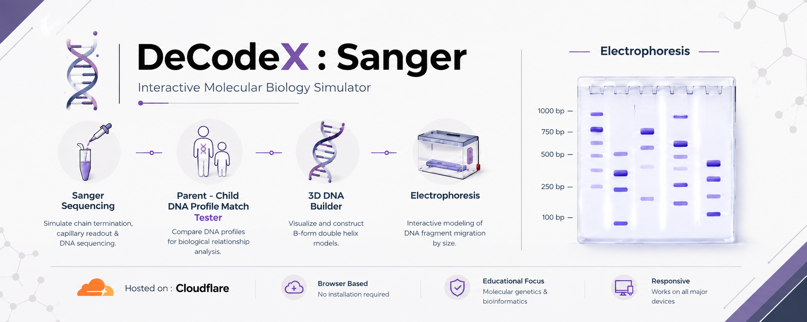

  

# 🧬 DeCodeX : Sanger

### *Interactive DNA Sequencing & Genetic Analysis Simulator*

> An interactive molecular biology simulator for exploring Sanger sequencing, DNA profiling, VNTR analysis, and electrophoresis.

**🧬 DNA Sequencing · 🧪 Genetic Analysis · ⚡ Electrophoresis**

---

## ✦ Features

**🧬 Sanger Sequencing**  
Visualize chain termination, capillary electrophoresis, and DNA sequence readout.

**👨‍👩‍👧 Parent–Child DNA Analysis**  
Compare DNA profiles through interactive sequence matching.

**🔬 VNTR Analysis**  
Add and visualize Variable Number Tandem Repeats.

**⚡ Gel Electrophoresis**  
Simulate DNA fragment separation based on molecular size.

---

## 🧬 Core Concepts

**Sanger Sequencing · Chain Termination · DNA Profiling · VNTR · Gel Electrophoresis · Capillary Electrophoresis**

---

## ⚙️ Technology

**HTML · CSS · JavaScript**

**Repository:** GitHub & Codeberg  
**Hosting:** Cloudflare

---

## 📜 License

Distributed under the **GNU General Public License v3.0 (GPL-3.0)**.
